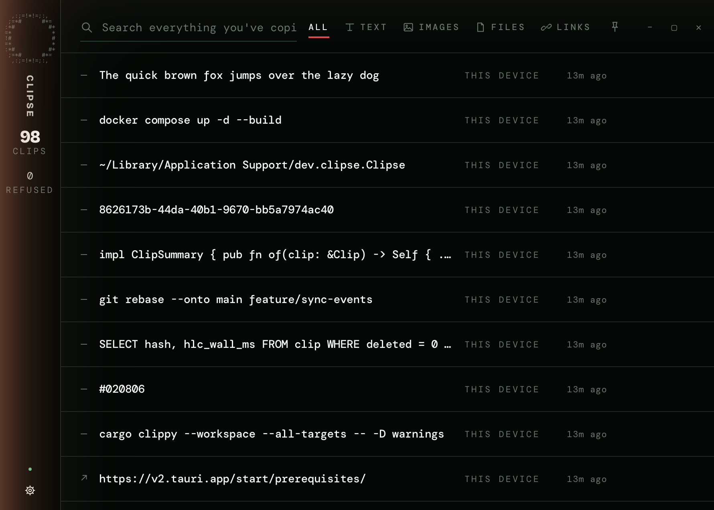
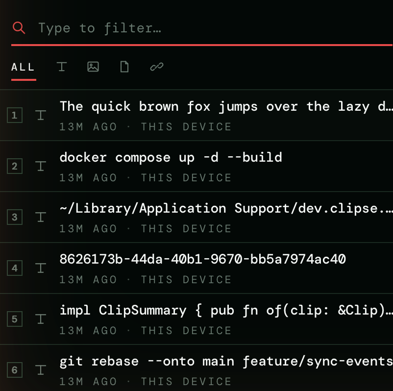
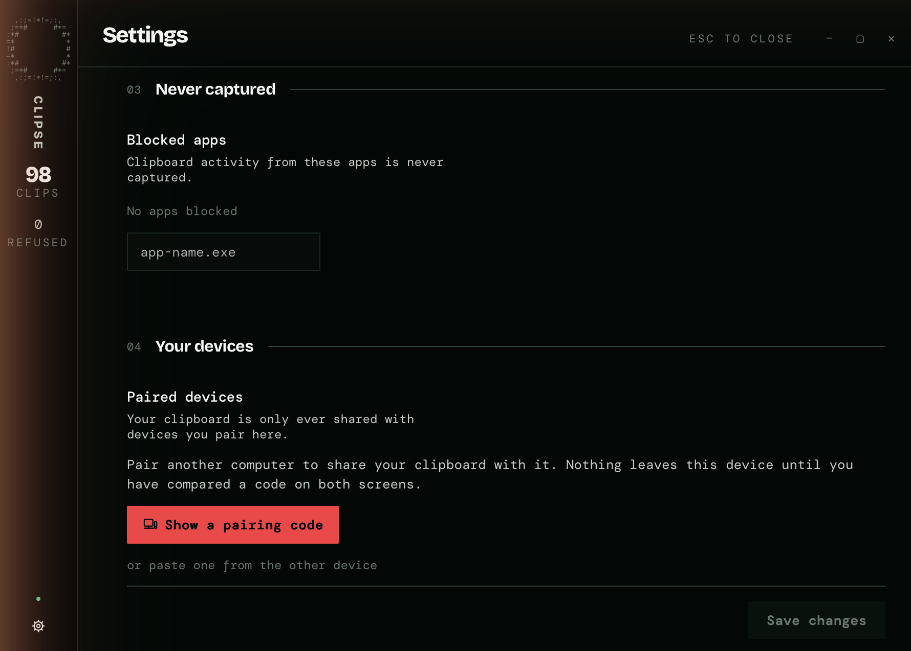
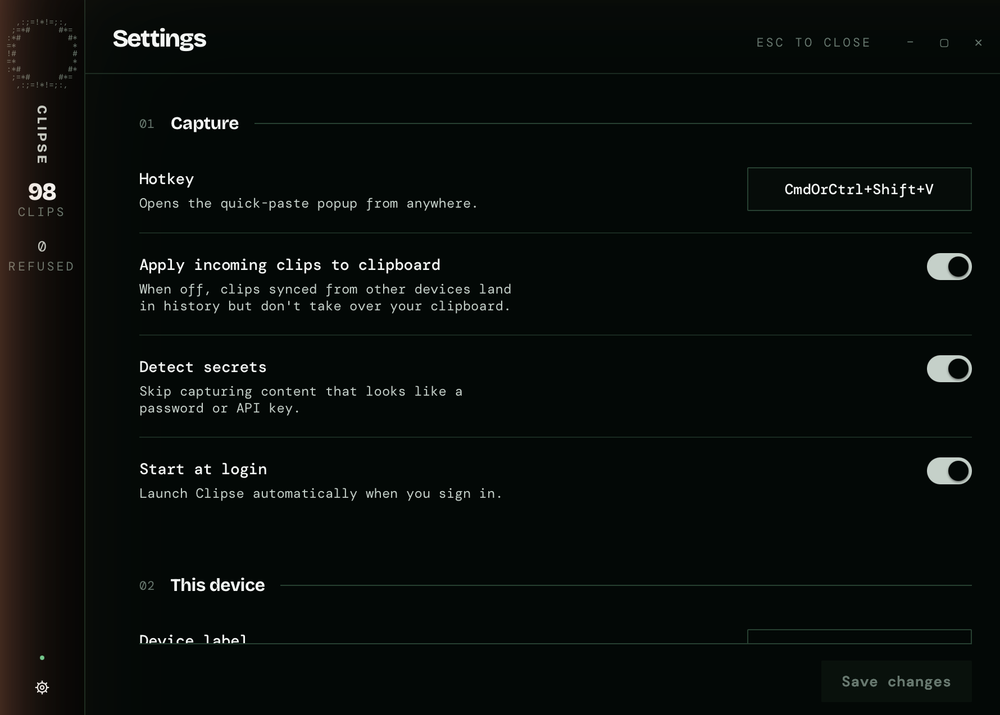

# Clipse

**Your clipboard, on every machine you own.** No server, no account, no cloud.

Clipse keeps everything you copy — text, links, images, files — and syncs it
straight between your own computers. On a LAN they find each other with mDNS and
talk over QUIC; away from home they reach each other across a Tailscale tailnet
on the same encrypted path. Nothing passes through anyone else's machine.



## What it does

- **Remembers everything.** No cap, no eviction, no "last 20 items". The history
  is a file on your machine, indexed for full-text search with SQLite FTS5, and
  it stays until you delete it.
- **Never remembers a password.** Copies from a password manager are not stored
  and not synced — not hidden, not encrypted, never written. The same goes for
  API keys, JWTs, card numbers and private keys. This is enforced in the capture
  path, before a history entry exists.
- **Syncs directly between your devices.** Paired by reading six digits off one
  screen and typing them on the other. Devices that never exchanged a code cannot
  read your clipboard, cannot ask for it, and cannot join by being on your
  network.
- **Handles more than text.** Images and files travel too; payloads too large to
  inline are content-addressed and transferred on their own streams.
- **Keeps working when the window is closed.** Sync lives in a background daemon,
  not in the UI.

## The quick-paste popup

One hotkey from anywhere, filter as you type, press a number to paste. It is the
surface you actually use; the history window is for when you need to go digging.



## Pairing

One device shows six digits; you type them on the other. That is the whole
ceremony — no link to paste, no code to compare afterwards. The digits are a
shared secret, not a label: both devices fold them into a transcript that also
covers each other's public keys, and each proves to the other that it derived
the same one. Someone sitting between your two machines cannot produce those
proofs, so the *devices* refuse rather than leaving you to notice.

A code is good for one pairing, expires after three minutes, and a device being
guessed at stops answering after a handful of wrong codes.



## Privacy

Non-negotiable, and enforced in code rather than in settings:

- Password-manager copies are never stored and never synced. Clipse honours
  `org.nspasteboard.ConcealedType` (macOS),
  `ExcludeClipboardContentFromMonitorProcessing` (Windows) and
  `x-kde-passwordManagerHint` (Linux), plus an app blocklist and a detector for
  API keys, JWTs and card numbers.
- No accounts, no telemetry, no relay server. Content only ever travels between
  your own paired devices.
- The webview runs under a content-security policy, so a compromised frontend
  dependency cannot exfiltrate your history.
- Auto-update is deliberately off: an unsigned update channel is a channel that
  trusts whoever reaches it first.



## Installing

Downloads are on the [releases page](https://github.com/fthsrbst/clipse/releases):
an MSI and an NSIS installer plus a portable `.exe` for Windows, a `.dmg` for
Apple-silicon macOS, and `.AppImage` and `.deb` for Linux.

Builds are unsigned on every platform. SmartScreen and Gatekeeper will warn you,
and they are right to — build it yourself if you would rather not take anyone's
word for it.

**macOS.** The builds are signed ad-hoc rather than with an Apple Developer ID,
so a downloaded copy is not notarised and will not open on the first
double-click. Open it once with **right-click → Open**, or clear the download
flag yourself:

```bash
xattr -dr com.apple.quarantine /Applications/Clipse.app
```

After that it launches normally, and updates do not ask again. The dmg is
Apple-silicon only for now.

## How it works

The daemon (`clipsed`) owns the truth: the clipboard, the history, the device
identity and the sync sessions. The desktop app is a view over it and reaches
everything through one IPC socket — it never touches the store or the network
directly. Closing the window does not stop syncing.

Two paired devices exchange a summary of what each holds, ask for what they
lack, and merge by hybrid logical clock, so the same clip copied on two machines
at once converges instead of duplicating. Sessions are Noise_IK over QUIC:
mutual authentication against keys exchanged at pairing time, and an unpaired
device cannot open a session at all.

| Path | What lives there |
| --- | --- |
| `crates/clipse-core` | Shared domain types: clips, content hashes, HLC, device ids |
| `crates/clipse-clipboard` | `Clipboard` trait + per-platform watchers |
| `crates/clipse-store` | SQLite history, FTS5 search, content-addressed blobs |
| `crates/clipse-crypto` | Device keys, pairing, Noise sessions, key rotation |
| `crates/clipse-net` | Transport abstraction, QUIC, mDNS discovery, Tailscale resolution |
| `crates/clipse-sync` | Merge rules, loop guard, chunked transfer |
| `crates/clipse-ipc` | Daemon ⇄ UI protocol over unix socket / named pipe |
| `crates/clipsed` | The background daemon |
| `apps/clipse-app` | Tauri v2 desktop UI |
| `assets/` | Vector brand assets |

`clipse-core` is the contract every other crate depends on. It contains no I/O,
no async and no platform code.

## Status

Early development, and honest about it. Cross-device sync has been exercised
end-to-end between macOS and Windows on a LAN; the tailnet path and Linux
desktops have had less real-world use. GNOME on Wayland has no
`wlr-data-control`, so there is no background clipboard monitoring there —
Clipse falls back to manual push and says so in the UI.

See [docs/roadmap.md](docs/roadmap.md) for what is done and what is next.

## Building

Requires a stable Rust toolchain (1.90+), Node 22 and pnpm. Platform
prerequisites for the desktop app are the standard
[Tauri v2](https://v2.tauri.app/start/prerequisites/) ones.

```bash
cargo test --workspace
cargo clippy --workspace --all-targets -- -D warnings
```

Run a daemon on its own data directory:

```bash
cargo run -p clipsed -- --data-dir ./.clipse-dev/a
```

Two useful examples ship with the daemon: `clipse-ctl` talks to a running
`clipsed` over the same IPC the UI uses, and `clipse-probe` answers the
questions a one-sided store cannot — whether a paired peer can actually be
reached, and what it holds.

```bash
cargo run -p clipsed --example clipse-ctl -- status
cargo run -p clipsed --example clipse-probe -- inventory
```

Build the desktop app:

```bash
cd apps/clipse-app && pnpm install && pnpm tauri build
```

## Licence

MIT
